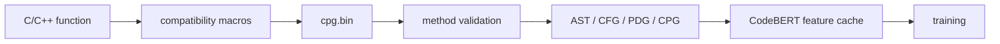

# CPG 漏洞检测实验工程

本项目面向 F&Q / Devign 函数级漏洞检测任务，系统比较两条路线：一条路线先把 C/C++ 函数转换为代码属性图（CPG），再进行图表示学习；另一条路线完全不构造 AST、CFG、PDG 或 CPG，直接从源码 token 序列进行端到端学习。

当前实验的核心约束是固定 `0.5` 阈值评价。我们不使用验证集最优 F1 阈值重新调节测试阈值，因为这会很容易把 Recall 和 PPR 推高到接近全正类预测。所有正式结果必须同时报告 Precision、Recall、F1、MCC、PPR、ROC-AUC 和 PR-AUC。

论文版总报告见 [终极论文版实验报告.md](终极论文版实验报告.md)。阶段性实验记录见 [实验报告2.md](实验报告2.md)，数据预处理记录见 [数据预处理.md](数据预处理.md)。

---

## 当前结论

截至 2026-06-21，当前最适合作为论文主结果的是 `RAMP-v2A`。它不是历史最高 F1 的配置，但在固定 `0.5` 阈值下同时取得当前最高 F1 和最高 MCC，并且 PPR 低于历史最高 F1 版本，因此更适合作为稳健主结果。

四个核心方法如下：

| 路线 | 方法 | 定位 |
| --- | --- | --- |
| CPG 图学习 | `RAMP-v2A` | 主方法，关系感知 CPG 与 CodeBERT 融合 |
| CPG 图学习 | `RAMP-v2Gated` | 聚合后节点级门控残差 RGCN，用于检验 CPG 噪声问题 |
| CPG 图学习 | `RAMP-v3 Slice-MIL` | 切片级弱监督局部证据建模，用于处理函数级弱标签 |
| 端到端源码学习 | `RawCode-MIL` | 不构造中间表示，直接从源码 token 窗口学习 |

`RAMP-v2Dual` 保留为诊断消融。它显式拆分 graph head、semantic head 和 fusion head，有助于解释图分支与语义分支的贡献，但不作为四个核心方法之一。

---

## 当前主要结果

以下结果均来自 `strict` split，均使用固定 `0.5` 阈值的测试集指标。测试集包含 `652` 个样本，其中正类 `309` 个、负类 `343` 个，真实正类比例约为 `0.4739`。`PPR` 是 predicted positive rate，用于监控模型是否过度预测正类。

| 类别 | Run | Model | Precision | Recall | F1 | MCC | PPR | ROC-AUC | PR-AUC |
| --- | --- | --- | ---: | ---: | ---: | ---: | ---: | ---: | ---: |
| 主结果 | `ramp-E4-v2A-core-cpg-current-schema-fixed05-guarded-f1-rank02-replay025-20e` | `ramp-v2-rgcn` | 0.5399 | 0.7468 | **0.6267** | **0.1841** | 0.6544 | **0.6233** | **0.6079** |
| 诊断消融 | `ramp-E4-v2Dual-raw-v1-fixed05-mcc-lr3e4-20e` | `ramp-v2-dual` | **0.5400** | 0.7240 | 0.6186 | 0.1763 | **0.6344** | 0.6163 | 0.5975 |
| 图门控 | `ramp-E4-v2Gated-raw-v1-fixed05-guarded-f1-lr3e4-25e` | `ramp-v2-gated-rgcn` | 0.5218 | **0.7760** | 0.6240 | 0.1503 | 0.7035 | 0.6150 | 0.5928 |
| Slice-MIL | `ramp-E4-v3SliceMIL-core-cpg-trueSliceMask-20e-noRank-aux02-fusion3` | `ramp-v3-slice-mil` | 0.5379 | 0.7370 | 0.6219 | 0.1762 | 0.6482 | 0.6164 | 0.5948 |
| 端到端源码 | `end2end-codebert-mil-strict-fixed05-posw165` | `RawCode-MIL` | 0.5172 | 0.7282 | 0.6048 | 0.1228 | 0.6672 | 0.6165 | 0.6004 |

结果解释：

1. `RAMP-v2A` 是当前最稳健主模型，F1 和 MCC 均为当前最高。
2. `RAMP-v2Gated` 的 Recall 最高，但 PPR 也最高，说明它更倾向于扩大正类预测范围。
3. `RAMP-v3 Slice-MIL` 的理论动机更强，但当前 slice 分支权重偏低，还没有真正主导最终决策。
4. `RawCode-MIL` 证明不构造中间表示也能学到有效信号，但 MCC 明显低于 `RAMP-v2A`，说明显式结构建模仍然有价值。
5. 所有方法的 PPR 都高于测试集真实正类比例，后续优化不能只追求 Recall 或 F1，必须同步控制 PPR 并提高 MCC。

---

## 数据与预处理

数据集路径由 `configs/default.yaml` 管理：

| 项 | 默认路径 |
| --- | --- |
| GraphML 数据 | `data/fq_graphml_dataset` |
| 标签 CSV | `data/fq_graphml_dataset/metadata/labels.csv` |
| 源码根目录 | `F&Q/F&Q` |
| 中间产物 | `artifacts/` |
| 训练输出 | `outputs/` |

当前 manifest 共保留 `6503` 个可用函数样本，其中负类 `3429` 个、正类 `3074` 个。严格划分使用规范化源码哈希分组，避免同源函数跨训练、验证和测试集合泄漏。

| Split | 样本数 | 负类 | 正类 | 正类比例 |
| --- | ---: | ---: | ---: | ---: |
| Train | 5201 | 2743 | 2458 | 0.4726 |
| Validation | 650 | 343 | 307 | 0.4723 |
| Test | 652 | 343 | 309 | 0.4739 |
| Total | 6503 | 3429 | 3074 | 0.4727 |

预处理阶段需要特别注意真实项目宏缺失问题。早期实验中，部分样本能够生成 `cpg.bin`，但导出的 PDG 为空图，原因是 FFmpeg 这类项目中的 `av_cold` 宏没有随数据集头文件一起提供，导致 Joern C frontend 无法正确识别函数声明。补充类似 `#define av_cold` 的兼容宏后，CPG 可以正确识别函数、调用和操作符节点。



---

## 文本归一化

项目支持三种节点文本与函数源码文本归一化模式：

| Config | normalization key | 用途 |
| --- | --- | --- |
| `configs/default.yaml` | `raw-v1` | 保留原始命名，是当前主结果配置 |
| `configs/semantic_anon.yaml` | `semantic-anon-v1` | 匿名用户命名，同时保留部分语义标签和 API 类别 |
| `configs/full_anon.yaml` | `full-anon-v1` | 更强匿名化，用于验证模型是否依赖变量名、函数名和项目命名风格 |

匿名化会处理参数名、局部变量名、字段名、用户自定义函数名、用户自定义类型名以及未知标识符。关键词、基础类型、Joern operator 和部分 API 语义类别会被保留。字面量会被规范为 `STR`、`CHAR`、`HEX`、`FLOAT`、`NUM_0`、`NUM_1`、`NUM_2` 或 `NUM`。

缓存和输出按 normalization key 隔离：

```text
artifacts/normalization/<key>/topologies/
artifacts/normalization/<key>/features/
artifacts/normalization/<key>/retrieval/
outputs/runs/<key>/
outputs/reports/<key>/
```

不要把旧的 `function_source_normalization=raw` 的 full-anon run 当作干净匿名结果。干净匿名结果必须同时满足 `normalization_key=full-anon-v1` 和 `function_source_normalization=full-anon-v1`。

---

## 模型结构

### RAMP-v2A

`RAMP-v2A` 是当前主模型，实现位于 `src/cpg_vuln/models/ramp_v2.py`。它将节点级 CodeBERT 向量、节点类型 embedding、三层 RGCN、MultiPoolReadout 和函数级 CodeBERT 语义分支结合起来。图分支负责传播 AST、CFG、CDG 和 REACHING_DEF 等结构关系，语义分支负责提供函数级源码上下文，fusion gate 负责融合两条分支。

### RAMP-v2Gated

`RAMP-v2Gated` 使用 `ramp-v2-gated-rgcn` 入口。它在 RGCN 聚合之后加入节点级 gate：

```text
message = RGCNConv(h, edge_index, edge_type)
gate = sigmoid(W_gate([h, message]))
candidate = GELU(W_candidate(message))
h = LayerNorm(h + Dropout(gate * candidate))
```

这个 gate 是聚合后的节点级更新门控，不是 relation-wise gate，也不是 edge-type gate。因此它不能声称精细抑制某一种 CPG 关系噪声，只能解释为控制节点是否吸收聚合后的整体图消息。

### RAMP-v3 Slice-MIL

`RAMP-v3 Slice-MIL` 使用 `ramp-v3-slice-mil` 入口。它把函数级弱标签问题转化为切片级局部证据聚合问题。候选 slice 优先来自危险 API 调用，例如 `malloc`、`free`、`memcpy`、`strcpy`、`sprintf`、`scanf`、`recv` 和 `read`；如果没有危险 API，则退化使用数组访问、字段访问、指针解引用等内存访问相关节点。模型从候选节点中选择 top-k 风险节点，通过 MIL 聚合得到 slice logits。

### RawCode-MIL

`RawCode-MIL` 位于 `src/cpg_vuln/end2end/`。它直接读取源码，不构造 AST、CFG、PDG 或 CPG。每个函数被切分为若干 CodeBERT token 窗口，每个窗口编码为 chunk 向量，再通过 gated attention MIL 聚合成函数级表示。当前正式配置使用 `max_length=128`、`stride=64`、`max_chunks=2` 和 `positive_class_weight=1.65`。

---

## 环境

推荐使用当前已验证的 `EIT` conda 环境：

```powershell
conda activate EIT
.\scripts\setup_eit.ps1
$env:PYTHONPATH = "src"
```

项目依赖由 `pyproject.toml` 管理，核心版本包括 Python `3.13`、PyTorch `2.7.0`、PyTorch Geometric `2.7.0`、Transformers `4.51.x`、scikit-learn `1.6.x`、NumPy `2.2.x`、pandas `2.2.x` 和 matplotlib `3.10.x`。训练设备按配置使用 CUDA。项目路径包含中文时，优先直接激活环境后运行 `python`，不要额外套多层 shell 包装。

---

## 构建数据与特征缓存

### 1. 审计数据集

```powershell
$env:PYTHONPATH = "src"
python -m cpg_vuln --config configs/default.yaml audit
```

审计输出写入 `artifacts/data/`，包括 `manifest.jsonl` 和 strict split。

### 2. 构建 raw-v1 拓扑与 CodeBERT 缓存

```powershell
$env:PYTHONPATH = "src"
python -m cpg_vuln --config configs/default.yaml build-topologies --force
python -m cpg_vuln --config configs/default.yaml build-codebert-cache
```

可选 Word2Vec 缓存：

```powershell
python -m cpg_vuln --config configs/default.yaml build-word2vec --force
```

### 3. 构建 full-anon-v1 拓扑与 CodeBERT 缓存

```powershell
$env:PYTHONPATH = "src"
python -m cpg_vuln --config configs/full_anon.yaml build-topologies --force
python -m cpg_vuln --config configs/full_anon.yaml build-codebert-cache --force
```

---

## 复现实验

所有正式命令都使用固定 `0.5` 阈值，并建议使用以下 checkpoint guard：

```text
0.25 <= checkpoint PPR <= 0.75
checkpoint recall <= 0.90
```

### 1. 如果 E3 hard-negative bank 不存在

`E4` 依赖同一 normalization key 下的 `E3` hard-negative bank。缺失时先运行：

```powershell
$env:PYTHONPATH = "src"
python -m cpg_vuln --config configs/default.yaml train-ramp `
  --experiment E3 `
  --split strict `
  --view core-cpg `
  --model ramp-v2-rgcn `
  --run-name ramp-E3-v2A-raw-v1-bank-lr3e4-20e `
  --lambda-replay 0.25 `
  --lambda-rank 0.20 `
  --margin 0.35 `
  --max-pairs-per-positive 2 `
  --checkpoint-metric mcc `
  --threshold-strategy fixed_0_5 `
  --checkpoint-min-ppr 0.25 `
  --checkpoint-max-ppr 0.75 `
  --checkpoint-max-recall 0.90 `
  --learning-rate 0.0003 `
  --epochs 20 `
  --force
```

### 2. RAMP-v2A 主结果

```powershell
$env:PYTHONPATH = "src"
python -m cpg_vuln --config configs/default.yaml train-ramp `
  --experiment E4 `
  --split strict `
  --view core-cpg `
  --model ramp-v2-rgcn `
  --run-name ramp-E4-v2A-core-cpg-current-schema-fixed05-guarded-f1-rank02-replay025-20e `
  --lambda-replay 0.25 `
  --lambda-rank 0.20 `
  --margin 0.35 `
  --max-pairs-per-positive 2 `
  --checkpoint-metric f1 `
  --threshold-strategy fixed_0_5 `
  --checkpoint-min-ppr 0.25 `
  --checkpoint-max-ppr 0.75 `
  --checkpoint-max-recall 0.90 `
  --learning-rate 0.0003 `
  --epochs 20 `
  --force
```

### 3. RAMP-v2Gated

```powershell
$env:PYTHONPATH = "src"
python -m cpg_vuln --config configs/default.yaml train-ramp `
  --experiment E4 `
  --split strict `
  --view core-cpg `
  --model ramp-v2-gated-rgcn `
  --run-name ramp-E4-v2Gated-raw-v1-fixed05-guarded-f1-lr3e4-25e `
  --lambda-replay 0.25 `
  --lambda-rank 0.20 `
  --margin 0.35 `
  --max-pairs-per-positive 2 `
  --checkpoint-metric f1 `
  --threshold-strategy fixed_0_5 `
  --checkpoint-min-ppr 0.25 `
  --checkpoint-max-ppr 0.75 `
  --checkpoint-max-recall 0.90 `
  --learning-rate 0.0003 `
  --epochs 25 `
  --force
```

### 4. RAMP-v3 Slice-MIL

```powershell
$env:PYTHONPATH = "src"
python -m cpg_vuln --config configs/ramp_v3_fusion3.yaml train-ramp `
  --experiment E4 `
  --split strict `
  --view core-cpg `
  --model ramp-v3-slice-mil `
  --run-name ramp-E4-v3SliceMIL-core-cpg-trueSliceMask-20e-noRank-aux02-fusion3 `
  --lambda-replay 0.25 `
  --lambda-rank 0.0 `
  --lambda-auxiliary 0.2 `
  --margin 0.35 `
  --max-pairs-per-positive 2 `
  --checkpoint-metric f1 `
  --threshold-strategy fixed_0_5 `
  --checkpoint-min-ppr 0.25 `
  --checkpoint-max-ppr 0.75 `
  --checkpoint-max-recall 0.90 `
  --learning-rate 0.0003 `
  --epochs 20 `
  --force
```

### 5. RawCode-MIL 端到端源码学习

```powershell
$env:PYTHONPATH = "src"
python -m cpg_vuln --config configs/end2end_codebert_mil.yaml train-end2end `
  --split strict `
  --run-name end2end-codebert-mil-strict-fixed05-posw165 `
  --checkpoint-metric f1 `
  --threshold-strategy fixed_0_5 `
  --learning-rate 0.000005 `
  --positive-class-weight 1.65 `
  --checkpoint-min-ppr 0.25 `
  --checkpoint-max-ppr 0.75 `
  --checkpoint-max-recall 0.90 `
  --epochs 3 `
  --force
```

### 6. RAMP-v2Dual 诊断消融

```powershell
$env:PYTHONPATH = "src"
python -m cpg_vuln --config configs/default.yaml train-ramp `
  --experiment E4 `
  --split strict `
  --view core-cpg `
  --model ramp-v2-dual `
  --run-name ramp-E4-v2Dual-raw-v1-fixed05-mcc-lr3e4-20e `
  --lambda-replay 0.25 `
  --lambda-rank 0.20 `
  --margin 0.35 `
  --max-pairs-per-positive 2 `
  --checkpoint-metric mcc `
  --threshold-strategy fixed_0_5 `
  --checkpoint-min-ppr 0.25 `
  --checkpoint-max-ppr 0.75 `
  --checkpoint-max-recall 0.90 `
  --learning-rate 0.0003 `
  --epochs 20 `
  --force
```

---

## 评估、解释与可视化

复评估 RAMP run：

```powershell
$env:PYTHONPATH = "src"
python -m cpg_vuln --config configs/default.yaml evaluate-ramp `
  --run ramp-E4-v2A-core-cpg-current-schema-fixed05-guarded-f1-rank02-replay025-20e `
  --split strict `
  --export-attention
```

生成 attention 解释：

```powershell
python -m cpg_vuln --config configs/default.yaml visualize-attention `
  --run ramp-E4-v2A-core-cpg-current-schema-fixed05-guarded-f1-rank02-replay025-20e
```

生成论文报告可视化：

```powershell
python scripts/make_report_visualizations.py
```

可视化输出位于：

```text
figures/report_visuals/
```

当前报告引用了 19 张图，覆盖方法路线、F1/MCC/PPR 权衡、Precision/Recall 平衡、阈值病理、概率分布、训练 loss、checkpoint guard、Gated 内部门控、Slice-MIL 融合权重、RawCode-MIL chunk 证据，以及 TP/FP/FN/TN 局部证据分析。

---

## 其他 baseline

### Devign / GGNN+Conv 风格基线

```powershell
$env:PYTHONPATH = "src"
python -m cpg_vuln --config configs/default.yaml train-devign `
  --split strict `
  --view core-cpg `
  --embedding codebert `
  --run-name devign-raw-v1-strict `
  --checkpoint-metric pr_auc `
  --threshold-strategy fixed_0_5 `
  --learning-rate 0.0003 `
  --epochs 20 `
  --force
```

当前 Devign 路线主要作为经典 baseline。已有实验中，它容易出现全负或全正倾向，暂时不是当前最佳方案。

### 基线矩阵

```powershell
$env:PYTHONPATH = "src"
python -m cpg_vuln --config configs/default.yaml train-baselines `
  --views ast cfg pdg `
  --embeddings word2vec codebert `
  --splits course strict `
  --force
```

### 增强模型矩阵

```powershell
$env:PYTHONPATH = "src"
python -m cpg_vuln --config configs/default.yaml train-enhanced `
  --variants selective-fusion no-semantics dataflow-only slice-fusion `
  --splits course strict `
  --force
```

---

## 评价原则

本项目当前统一使用以下评价约束：

1. 最终报告优先看 `test_fixed_0_5`。
2. 每次报告 F1 时必须同时报告 Precision、Recall、MCC、PPR、ROC-AUC 和 PR-AUC。
3. 不能只追求 Recall 或 F1，必须检查 PPR 是否接近全正预测。
4. 当前 RAMP checkpoint guard 推荐值为 `0.25 <= PPR <= 0.75` 且 `Recall <= 0.90`。
5. `strict` split 优先于 `course` split，因为它更能避免重复代码跨集合泄漏。

常用指标解释：

| 指标 | 解释 |
| --- | --- |
| Precision | 判为漏洞的样本中，有多少是真的漏洞 |
| Recall | 真漏洞中，有多少被模型找出来 |
| F1 | Precision 和 Recall 的调和平均 |
| MCC | 更严格的二分类综合指标，对全正或全负预测更敏感 |
| PPR | 模型预测为漏洞的比例，用于识别过度正类预测 |
| ROC-AUC | 全阈值排序质量指标 |
| PR-AUC | 更关注正类检索质量的排序指标 |

---

## 目录结构

```text
configs/                     实验配置和 source map override
scripts/                     环境脚本、审计脚本、可视化脚本
src/cpg_vuln/data/           审计、GraphML 解析、视图构建、split、dataset
src/cpg_vuln/end2end/        RawCode-MIL 端到端源码学习
src/cpg_vuln/features/       文本归一化、Word2Vec 和 CodeBERT 离线缓存
src/cpg_vuln/mining/         hard-negative bank、motif 和检索特征
src/cpg_vuln/models/         GCN、Devign、SelectiveFusion、RAMP v2/v3
src/cpg_vuln/training/       训练循环、loss、threshold、RAMP 训练逻辑
src/cpg_vuln/evaluation/     checkpoint 复评估
src/cpg_vuln/visualization/  汇总、attention 可视化和解释导出
tests/                       单元测试和 smoke tests
artifacts/                   可重建中间产物
outputs/                     run、checkpoint、predictions、metrics、reports
figures/report_visuals/      论文报告可视化
```

---

## 常见问题

### E4 提示缺少 E3 bank

先运行一次同 normalization key 下的 `E3`。E3 bank 默认位于：

```text
artifacts/normalization/<key>/retrieval/<split>/E3/bank.jsonl
```

### cache metadata mismatch

同一路径下已有旧 cache，但当前配置的模型、维度、归一化 fingerprint 或源码归一化状态不匹配。处理方式是使用新的 normalization key，或对构建命令加 `--force`，必要时删除对应 cache 目录后重建。

### CodeBERT 下载中断

删除不完整 Hugging Face cache 后重建：

```powershell
Remove-Item -Recurse -Force "$env:USERPROFILE\.cache\huggingface\hub\models--microsoft--codebert-base"
Remove-Item -Recurse -Force "$env:USERPROFILE\.cache\huggingface\hub\.locks\models--microsoft--codebert-base" -ErrorAction SilentlyContinue
python -m cpg_vuln --config configs/default.yaml build-codebert-cache
```

如果本地已经缓存完整模型，可以强制离线：

```powershell
Remove-Item Env:HF_ENDPOINT -ErrorAction SilentlyContinue
$env:HF_HUB_OFFLINE = "1"
$env:TRANSFORMERS_OFFLINE = "1"
python -m cpg_vuln --config configs/default.yaml build-codebert-cache
```

### 训练结果没有变化

训练命令默认发现已有 `metrics.json` 会跳过。重新训练时使用 `--force`，或者删除对应的：

```text
outputs/runs/<normalization-key>/<run-name>/
```

---

## 测试

运行核心测试：

```powershell
$env:PYTHONPATH = "src"
python -m pytest
```

针对 RAMP、CLI 和模型入口的快速回归：

```powershell
$env:PYTHONPATH = "src"
python -m pytest tests/test_runner.py tests/test_cli_training_options.py tests/test_ramp_v2_models.py tests/test_ensemble_probe.py -q
```

测试使用临时合成 GraphML，不依赖完整数据集，也不会触发 CodeBERT 下载。
