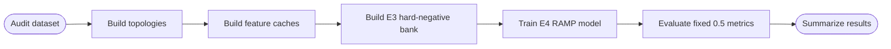

# CPG 漏洞检测实验工程

本项目从 Joern 导出的 GraphML 构建函数级 CPG 表示，并在 Devign 风格基线、RGCN、RAMP hard-negative 训练和命名归一化实验之间做系统对比。当前主线目标是：在固定 `0.5` 阈值评价下，尽可能提高漏洞检测指标，同时避免通过“几乎全判为漏洞”来虚高 F1。

---

## 当前最优结果

以下结果截至 2026-06-16，均来自 `strict` split，均使用固定 `0.5` 阈值的 `test_fixed_0_5` 指标。`PPR` 是 predicted positive rate，用于监控模型是否过度预测正类。

| 定位 | Run | Normalization | Model | Checkpoint | F1 | Precision | Recall | MCC | PPR | PR-AUC |
| --- | --- | --- | --- | --- | ---: | ---: | ---: | ---: | ---: | ---: |
| 最高 F1 | `ramp-E4-v2A-raw-v1-fixed05-guarded-f1-lr3e4-20e` | `raw-v1` | `ramp-v2-rgcn` | `f1` | **0.6312** | 0.5260 | 0.7890 | 0.1655 | 0.7097 | 0.5896 |
| 最均衡单模型 | `ramp-E4-v2A-raw-v1-fixed05-mcc-lr3e4-probe` | `raw-v1` | `ramp-v2-rgcn` | `mcc` | 0.6263 | 0.5344 | 0.7565 | 0.1748 | 0.6697 | 0.5935 |
| 最高 MCC/PR-AUC | `ramp-E4-v2Dual-raw-v1-fixed05-mcc-lr3e4-20e` | `raw-v1` | `ramp-v2-dual` | `mcc` | 0.6186 | **0.5400** | 0.7240 | **0.1763** | **0.6344** | **0.5975** |
| 干净匿名对照 | `ramp-E4-v2A-lr1e4-fixed05-guarded-f1-full-anon-fn-anon-strict-36e` | `full-anon-v1` | `ramp-v2-rgcn` | `f1` | 0.5806 | 0.5073 | 0.6786 | 0.0898 | 0.6329 | 0.5700 |

当前建议：

- 论文主结果若强调最高 F1，使用 `ramp-v2-rgcn + E4 + checkpoint=f1 + guard`。
- 若强调结果稳健性，使用 `ramp-v2-rgcn + E4 + checkpoint=mcc` 作为主单模型。
- 若强调新增结构贡献，使用 `ramp-v2-dual`，它的 MCC 和 PR-AUC 更高，但 F1 不是最高。
- `full-anon-v1` 是去命名泄漏和鲁棒性对照，不适合作为当前冲指标主结果。

不要把旧的 full-anon run 中 `function_source_normalization=raw` 的结果当作干净匿名结果。干净匿名结果必须同时满足 `normalization_key=full-anon-v1` 和 `function_source_normalization=full-anon-v1`。

---

## 方法概览

### 图表示

每个函数被转换为图样本，节点来自代码属性图中的语法或语义节点，边来自不同关系：

| View | 使用关系 |
| --- | --- |
| `ast` | `AST` |
| `cfg` | `CFG` |
| `pdg` | `CDG`, `REACHING_DEF` |
| `core-cpg` | `AST`, `CFG`, `CDG`, `REACHING_DEF` |
| `dataflow-cpg` | `CFG`, `CDG`, `REACHING_DEF` |
| `slice-cpg` | 从风险调用、数组、指针表达式等种子出发扩展局部 CPG |

当前最优 RAMP 实验使用 `core-cpg`。

### 模型路线

| 模型 | 作用 |
| --- | --- |
| `GCNClassifier` | 课程基线，分别在 `ast`、`cfg`、`pdg` 上训练 |
| `SelectiveFusionCPG` | 早期增强模型，融合图表示和函数级 CodeBERT 表示 |
| `DevignCPG` | GGNN+Conv 风格基线，用于对照经典 Devign 思路 |
| `RampV2CPG` / `ramp-v2-rgcn` | 当前主模型，使用 RGCN 区分不同 CPG 边类型，并融合函数级 CodeBERT |
| `RampV2DualHeadCPG` / `ramp-v2-dual` | 新增双头版本，分别保留图结构分支、语义分支和融合分支的 logits |

### RAMP 实验编号

| 实验 | 含义 |
| --- | --- |
| `E0` | 无 hard-negative replay/ranking 的 RAMP 基础训练 |
| `E1` | 随机 hard-negative replay |
| `E2` | false-positive-only hard-negative replay |
| `E3` | motif-matched hard-negative bank |
| `E4` | 在 E3 bank 上加入 ranking loss，是当前主实验 |

`E4` 依赖 `artifacts/normalization/<key>/retrieval/<split>/E3/bank.jsonl`。如果该文件不存在，需要先运行一次 `E3`。

---

## 实验流程



训练阶段只读取离线缓存，不会在训练时重新加载 Transformer。CodeBERT 首次构建缓存时会下载 `microsoft/codebert-base`。

---

## 环境

推荐使用当前已验证的 `EIT` conda 环境：

```powershell
conda activate EIT
.\scripts\setup_eit.ps1
```

Windows PowerShell 中建议显式设置 `PYTHONPATH`：

```powershell
$env:PYTHONPATH = "src"
```

当前工程在 Python 3.13、PyTorch 2.7、CUDA 12.6 和 RTX 4060 8 GB 上验证过。项目路径包含中文时，优先直接激活环境后运行 `python`，不要依赖额外的 `conda run` 包装层。

---

## 数据审计与缓存构建

### 1. 审计数据集

```powershell
$env:PYTHONPATH = "src"
python -m cpg_vuln --config configs/default.yaml audit
```

审计读取：

- 标签：`data/fq_graphml_dataset/metadata/labels.csv`
- GraphML 数据：`data/fq_graphml_dataset`
- 源码根目录：`F&Q/F&Q`
- source map override：`configs/source_map_overrides.csv`

输出写入 `artifacts/data/`，包括 `manifest.jsonl`、`course.json` 和 `strict.json`。当前实验优先使用 `strict` split，避免规范化源码重复导致跨集合泄漏。

### 2. 构建 raw-v1 拓扑与 CodeBERT 缓存

```powershell
$env:PYTHONPATH = "src"
python -m cpg_vuln --config configs/default.yaml build-topologies --force
python -m cpg_vuln --config configs/default.yaml build-codebert-cache
```

可选 Word2Vec 缓存：

```powershell
python -m cpg_vuln --config configs/default.yaml build-word2vec --force
```

### 3. 构建 full-anon-v1 拓扑与 CodeBERT 缓存

```powershell
$env:PYTHONPATH = "src"
python -m cpg_vuln --config configs/full_anon.yaml build-topologies --force
python -m cpg_vuln --config configs/full_anon.yaml build-codebert-cache
```

`full-anon-v1` 会对节点文本和函数源码文本做匿名化，缓存路径与 raw 隔离。

---

## 复现当前最优 raw-v1 结果

以下命令都使用固定 `0.5` 阈值评价，并在 checkpoint 选择时加入 guard：

- `--checkpoint-min-ppr 0.25`
- `--checkpoint-max-ppr 0.75`
- `--checkpoint-max-recall 0.90`

这些 guard 用来避免模型为了提高 F1 而把过多样本判为漏洞。

### 1. 如果 E3 bank 不存在，先运行 E3

```powershell
$env:PYTHONPATH = "src"
python -m cpg_vuln --config configs/default.yaml train-ramp `
  --experiment E3 `
  --split strict `
  --view core-cpg `
  --model ramp-v2-rgcn `
  --run-name ramp-E3-v2A-raw-v1-bank-lr3e4-20e `
  --lambda-replay 0.25 `
  --lambda-rank 0.20 `
  --margin 0.35 `
  --max-pairs-per-positive 2 `
  --checkpoint-metric mcc `
  --threshold-strategy fixed_0_5 `
  --checkpoint-min-ppr 0.25 `
  --checkpoint-max-ppr 0.75 `
  --checkpoint-max-recall 0.90 `
  --learning-rate 0.0003 `
  --epochs 20 `
  --force
```

### 2. 最高 F1 方案

```powershell
$env:PYTHONPATH = "src"
python -m cpg_vuln --config configs/default.yaml train-ramp `
  --experiment E4 `
  --split strict `
  --view core-cpg `
  --model ramp-v2-rgcn `
  --run-name ramp-E4-v2A-raw-v1-fixed05-guarded-f1-lr3e4-20e `
  --lambda-replay 0.25 `
  --lambda-rank 0.20 `
  --margin 0.35 `
  --max-pairs-per-positive 2 `
  --checkpoint-metric f1 `
  --threshold-strategy fixed_0_5 `
  --checkpoint-min-ppr 0.25 `
  --checkpoint-max-ppr 0.75 `
  --checkpoint-max-recall 0.90 `
  --learning-rate 0.0003 `
  --epochs 20 `
  --force
```

### 3. 最均衡单模型方案

```powershell
$env:PYTHONPATH = "src"
python -m cpg_vuln --config configs/default.yaml train-ramp `
  --experiment E4 `
  --split strict `
  --view core-cpg `
  --model ramp-v2-rgcn `
  --run-name ramp-E4-v2A-raw-v1-fixed05-mcc-lr3e4-probe `
  --lambda-replay 0.25 `
  --lambda-rank 0.20 `
  --margin 0.35 `
  --max-pairs-per-positive 2 `
  --checkpoint-metric mcc `
  --threshold-strategy fixed_0_5 `
  --checkpoint-min-ppr 0.25 `
  --checkpoint-max-ppr 0.75 `
  --checkpoint-max-recall 0.90 `
  --learning-rate 0.0003 `
  --epochs 20 `
  --force
```

### 4. 双头模型方案

```powershell
$env:PYTHONPATH = "src"
python -m cpg_vuln --config configs/default.yaml train-ramp `
  --experiment E4 `
  --split strict `
  --view core-cpg `
  --model ramp-v2-dual `
  --run-name ramp-E4-v2Dual-raw-v1-fixed05-mcc-lr3e4-20e `
  --lambda-replay 0.25 `
  --lambda-rank 0.20 `
  --margin 0.35 `
  --max-pairs-per-positive 2 `
  --checkpoint-metric mcc `
  --threshold-strategy fixed_0_5 `
  --checkpoint-min-ppr 0.25 `
  --checkpoint-max-ppr 0.75 `
  --checkpoint-max-recall 0.90 `
  --learning-rate 0.0003 `
  --epochs 20 `
  --force
```

---

## 复现 full-anon-v1 对照

先构建 full-anon 缓存，再运行 E3/E4。若 E3 bank 已存在，可以跳过 E3。

```powershell
$env:PYTHONPATH = "src"
python -m cpg_vuln --config configs/full_anon.yaml train-ramp `
  --experiment E4 `
  --split strict `
  --view core-cpg `
  --model ramp-v2-rgcn `
  --run-name ramp-E4-v2A-lr1e4-fixed05-guarded-f1-full-anon-fn-anon-strict-36e `
  --lambda-replay 0.25 `
  --lambda-rank 0.20 `
  --margin 0.35 `
  --max-pairs-per-positive 2 `
  --checkpoint-metric f1 `
  --threshold-strategy fixed_0_5 `
  --checkpoint-min-ppr 0.25 `
  --checkpoint-max-ppr 0.75 `
  --checkpoint-max-recall 0.90 `
  --learning-rate 0.0001 `
  --epochs 36 `
  --force
```

full-anon 的指标低于 raw-v1 是当前观察到的事实。它的主要用途是证明命名匿名化后模型仍有信号，同时暴露 raw 命名信息对指标的贡献。

---

## 其他实验命令

### Devign / GGNN+Conv 风格基线

```powershell
$env:PYTHONPATH = "src"
python -m cpg_vuln --config configs/default.yaml train-devign `
  --split strict `
  --view core-cpg `
  --embedding codebert `
  --run-name devign-raw-v1-strict `
  --checkpoint-metric pr_auc `
  --threshold-strategy fixed_0_5 `
  --learning-rate 0.0003 `
  --epochs 20 `
  --force
```

当前 Devign 路线主要作为经典 baseline。已有实验中，它容易出现全负或全正倾向，暂时不是当前最佳方案。

### 基线矩阵

```powershell
$env:PYTHONPATH = "src"
python -m cpg_vuln --config configs/default.yaml train-baselines `
  --views ast cfg pdg `
  --embeddings word2vec codebert `
  --splits course strict `
  --force
```

### 增强模型矩阵

```powershell
$env:PYTHONPATH = "src"
python -m cpg_vuln --config configs/default.yaml train-enhanced `
  --variants selective-fusion no-semantics dataflow-only slice-fusion `
  --splits course strict `
  --force
```

### 汇总与解释

```powershell
$env:PYTHONPATH = "src"
python -m cpg_vuln --config configs/default.yaml summarize
python -m cpg_vuln --config configs/default.yaml evaluate-ramp --run ramp-E4-v2A-raw-v1-fixed05-mcc-lr3e4-probe --split strict --export-attention
python -m cpg_vuln --config configs/default.yaml visualize-attention --run ramp-E4-v2A-raw-v1-fixed05-mcc-lr3e4-probe
```

---

## 评价原则

本项目当前统一使用以下评价约束：

- 最终报告优先看 `test_fixed_0_5`，即固定 `0.5` 阈值
- 每次报告 F1 时必须同时报告 precision、recall、MCC、PPR 和 PR-AUC
- 不能只追求 F1，必须监控 recall 和 PPR 是否接近全正预测
- 当前 RAMP checkpoint guard 推荐值为 `0.25 <= PPR <= 0.75` 且 `recall <= 0.90`
- `strict` split 优先于 `course` split，因为它更能避免重复代码跨集合泄漏

常用指标解释：

| 指标 | 解释 |
| --- | --- |
| Precision | 判为漏洞的样本中，有多少是真的漏洞 |
| Recall | 真漏洞中，有多少被模型找出来 |
| F1 | Precision 和 recall 的调和平均 |
| MCC | 更严格的二分类综合指标，对全正/全负更敏感 |
| PPR | 模型预测为漏洞的比例，用于识别过度正类预测 |
| PR-AUC | 排序质量指标，适合类别比例不完全均衡时观察 |

---

## 归一化模式

| Config | normalization key | 作用 |
| --- | --- | --- |
| `configs/default.yaml` | `raw-v1` | 保留原始节点文本和函数源码文本，是当前冲指标主配置 |
| `configs/semantic_anon.yaml` | `semantic-anon-v1` | 对用户定义命名做语义匿名，保留部分 API/类型语义 |
| `configs/full_anon.yaml` | `full-anon-v1` | 更强匿名化，用于验证模型是否依赖变量名、函数名等命名线索 |

缓存和输出按 normalization key 隔离：

```text
artifacts/normalization/<key>/topologies/
artifacts/normalization/<key>/features/
artifacts/normalization/<key>/retrieval/
outputs/runs/<key>/
outputs/reports/<key>/
```

raw 的函数级 CodeBERT cache 兼容旧路径：

```text
artifacts/features/codebert/functions-raw/
```

---

## 目录结构

```text
configs/                  实验配置和 source map override
scripts/                  环境脚本、审计脚本和 ensemble probe
src/cpg_vuln/data/        审计、GraphML 解析、视图构建、split、dataset
src/cpg_vuln/features/    文本归一化、Word2Vec 和 CodeBERT 离线缓存
src/cpg_vuln/mining/      hard-negative bank、motif 和检索特征
src/cpg_vuln/models/      GCN、Devign、SelectiveFusion、RAMP v2
src/cpg_vuln/training/    训练循环、loss、threshold、RAMP 训练逻辑
src/cpg_vuln/evaluation/  checkpoint 复评估
src/cpg_vuln/visualization/  汇总、attention 可视化和解释导出
tests/                    单元测试和 smoke tests
artifacts/                可重建中间产物
outputs/                  run、checkpoint、predictions、metrics、reports
```

---

## 常见问题

### E4 提示缺少 E3 bank

先运行一次同 normalization key 下的 `E3`：

```powershell
python -m cpg_vuln --config configs/default.yaml train-ramp --experiment E3 --split strict --view core-cpg --model ramp-v2-rgcn --force
```

### cache metadata mismatch

同一路径下已有旧 cache，但当前配置的模型、维度、归一化 fingerprint 或源码归一化状态不匹配。推荐不要混用旧目录，处理方式是：

- 使用新的 normalization key 或 run name
- 对对应构建命令加 `--force`
- 必要时手动删除对应 cache 目录后重建

### CodeBERT 下载中断

删除不完整 Hugging Face cache 后重建：

```powershell
Remove-Item -Recurse -Force "$env:USERPROFILE\.cache\huggingface\hub\models--microsoft--codebert-base"
Remove-Item -Recurse -Force "$env:USERPROFILE\.cache\huggingface\hub\.locks\models--microsoft--codebert-base" -ErrorAction SilentlyContinue
python -m cpg_vuln --config configs/default.yaml build-codebert-cache
```

如果本地已经缓存完整模型，可以强制离线：

```powershell
Remove-Item Env:HF_ENDPOINT -ErrorAction SilentlyContinue
$env:HF_HUB_OFFLINE = "1"
$env:TRANSFORMERS_OFFLINE = "1"
python -m cpg_vuln --config configs/default.yaml build-codebert-cache
```

### 训练结果没有变化

训练命令默认发现已有 `metrics.json` 会跳过。重新训练时使用：

```powershell
python -m cpg_vuln --config configs/default.yaml train-ramp --experiment E4 --split strict --force
```

或者删除对应 `outputs/runs/<normalization-key>/<run-name>/`。

---

## 测试

运行核心测试：

```powershell
$env:PYTHONPATH = "src"
python -m pytest
```

针对 RAMP、CLI 和模型入口的快速回归：

```powershell
$env:PYTHONPATH = "src"
python -m pytest tests/test_runner.py tests/test_cli_training_options.py tests/test_ramp_v2_models.py tests/test_ensemble_probe.py -q
```

测试使用临时合成 GraphML，不依赖完整数据集，也不会触发 CodeBERT 下载。
